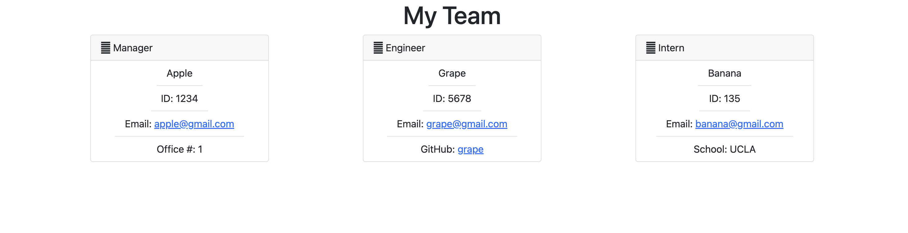

# team-profile-generator
## Table of Contents
* [Description](#description)

## Description

Using Node.js command-line application that takes in information about individuals on a software engineering team, it then generates an HTML webpage that displays summaries for each person

Testing is key to making code maintainable, so you’ll also write a unit test for every part of your code and ensure that it passes each test.


## Installation

> **Note**: This project uses Inquirer

## User Story

```md
AS A manager
I WANT to generate a webpage that displays my team's basic info
SO THAT I have quick access to their emails and GitHub profiles
```

## Images



Picture displays the preview of the html.

## Video Link
https://drive.google.com/file/d/1iEimoCmhUN91OrW_t9QjunbQ-Zh3om4n/view
